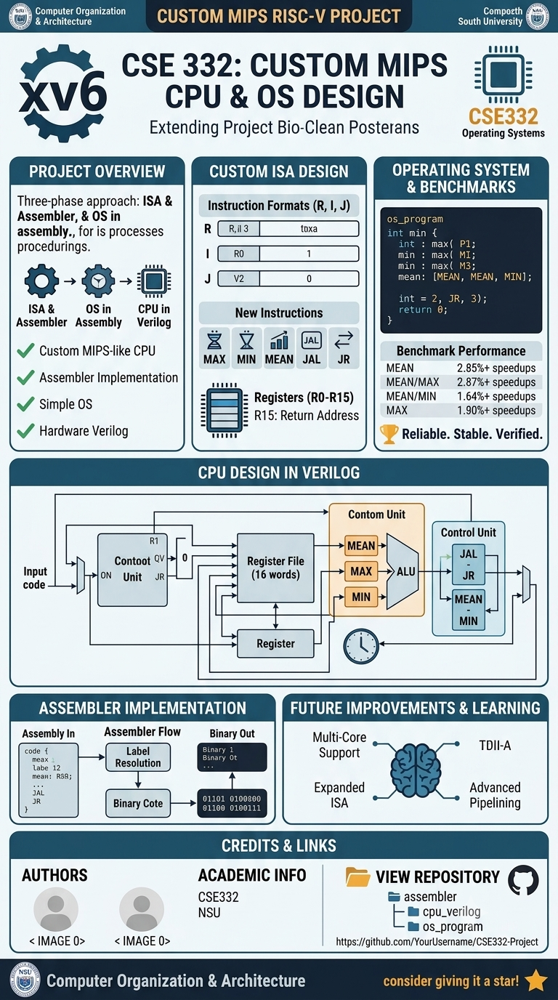

# 🖥️ CSE 332 Project – MIPS CPU & OS Design

This repository contains our **Computer Organization & Architecture (CSE 332)** group project at **North South University (NSU)**.  
The project is divided into **three major phases**: **ISA & Assembler**, **Operating System in Assembly**, and **CPU Design in Verilog**.

---

## 📌 Project Overview
We designed a **custom MIPS-like CPU** with an assembler, operating system, and hardware implementation in Verilog.  
The project follows these steps:

1. **Instruction Set Architecture (ISA) Design**  
   - Define new instructions: `MAX`, `MIN`, `MEAN`, `JAL`, `JR`.  
   - Decide instruction formats (R-type, I-type, J-type).  
   - Create opcode/function codes.  
   - Define register file size & usage.

2. **Assembler Implementation**  
   - A simple assembler written in **C++/Python/Java**.  
   - Converts our assembly language into **binary/hexadecimal machine code**.  
   - Supports labels for branching & function calls.

3. **Operating System in Assembly**  
   - Written in our **custom ISA assembly**.  
   - Supports:  
     - Function calls using `JAL` / `JR`  
     - Mathematical operations: `MAX`, `MIN`, `MEAN`  
     - Register management  
   - Benchmark programs written and tested.

4. **CPU Implementation in Verilog**  
   - Datapath design (ALU, Control Unit, Register File, Memory).  
   - Modified control to support **new instructions** (`MAX`, `MIN`, `MEAN`, `JAL`, `JR`).  
   - Tested using **ModelSim/Xilinx simulation** with benchmark programs.

---

## 🛠️ Instruction Set Architecture (ISA)

### Registers
- `R0` → Constant `0` (read-only)  
- `R1–R14` → General purpose  
- `R15` → Return address (for `JAL` / `JR`)  

### Instruction Formats
- **R-Type:** `opcode (6) | rs (5) | rt (5) | rd (5) | shamt (5) | funct (6)`  
- **I-Type:** `opcode (6) | rs (5) | rt (5) | immediate (16)`  
- **J-Type:** `opcode (6) | address (26)`

### New Instructions
| Instruction | Type | Description |
|-------------|------|-------------|
| `MAX rd, rs, rt` | R-Type | Stores max(rs, rt) in rd |
| `MIN rd, rs, rt` | R-Type | Stores min(rs, rt) in rd |
| `MEAN rd, rs, rt` | R-Type | Stores (rs + rt)/2 in rd |
| `JAL addr` | J-Type | Jump & save return address in R15 |
| `JR rs` | R-Type | Jump to address in rs |

---

## 📂 Repository Structure
📦 CSE332-Project
┣ 📁 assembler # Assembler code (C++/Python/Java)
┣ 📁 os_program # Operating System in MIPS Assembly
┣ 📁 cpu_verilog # Verilog source files for CPU design
┣ 📁 benchmarks # Test programs in assembly
┣ 📁 docs # Report, diagrams, screenshots
┣ README.md # Project documentation
